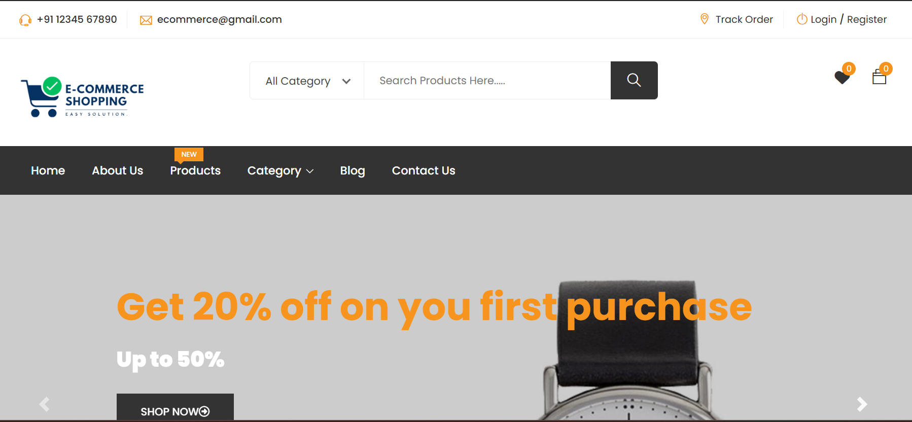
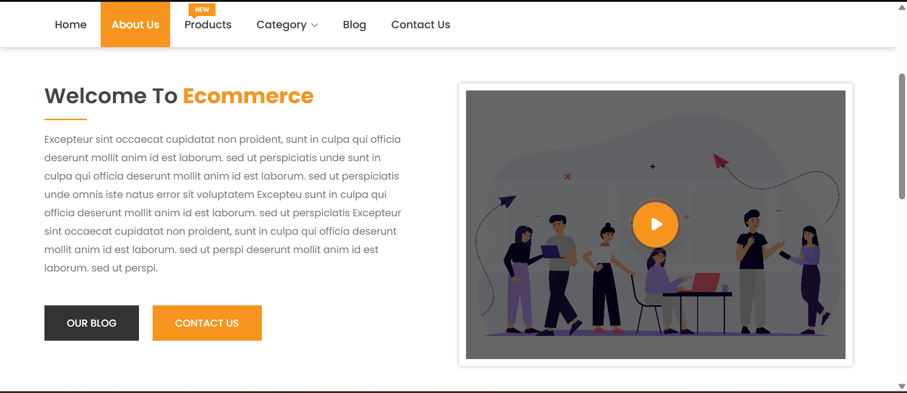
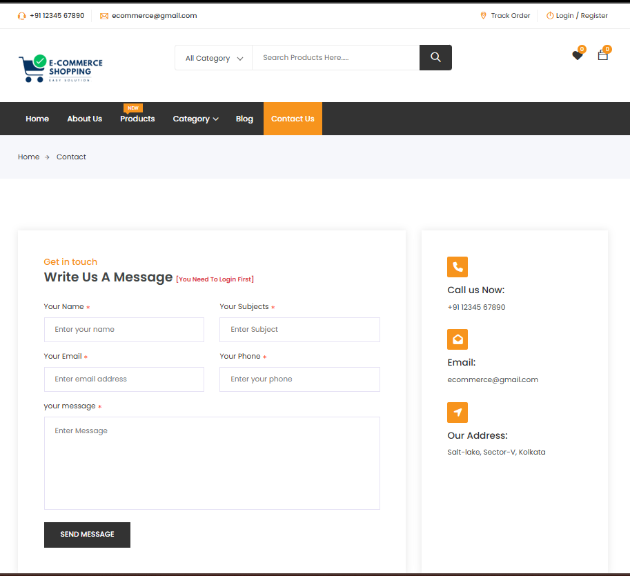
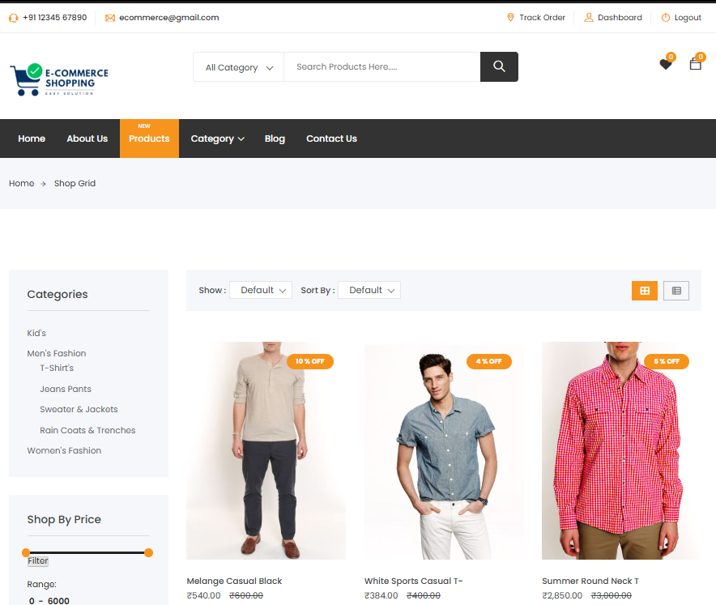
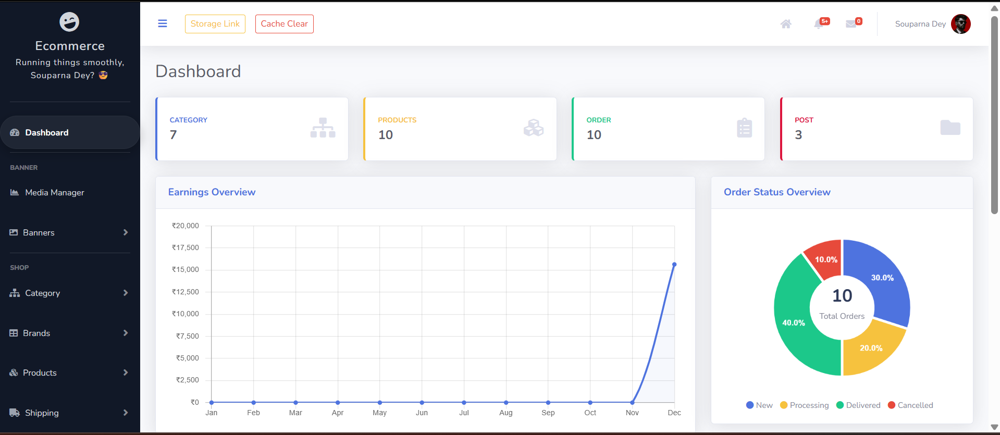
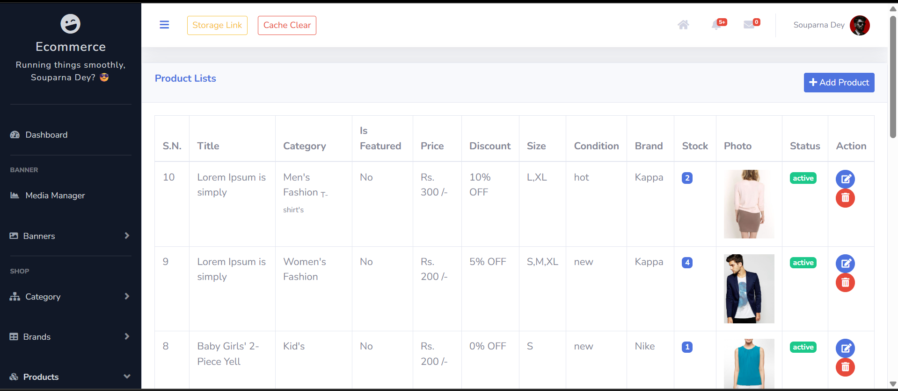
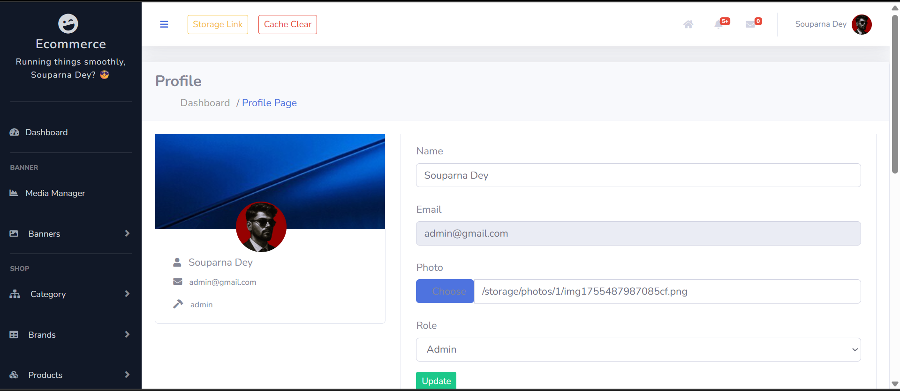

# 🚀 Complete eCommerce Web Application in Laravel
A production-ready, full-featured **e-commerce solution** built with Laravel (PHP), offering a modern UI & frontend design, full-fledged & secure admin panel with role-based authentication, seamless payment integration and a smooth & user-friendly shopping experience.

This project follows best practices in Laravel architecture, MVC separation, reusable components, and scalable database design — making it ideal for learning, customization, or real deployment.

---

## 🎯 Objective

This project demonstrates a complete, real-world e-commerce workflow including product management, order processing, payments, authentication, and role-based administration using Laravel.

---

## 👥 Who Is This For?

- Laravel developers looking for a real-world e-commerce reference
- Students learning full-stack Laravel development
- Freelancers building scalable e-commerce solutions
- Recruiters evaluating Laravel project architecture

---

## 🌟 Key Features

### 🔹 **Frontend**
- ⚡ **Progressive Web App (PWA) support**
- 🎨 **Clean, modern & fully responsive UI**
- 🛒 **Cart, wishlist & checkout system**
- 📜 **FAQ, help, terms & conditions**
- 📦 **Order tracking & history**
- 🔎 **Product search & category filtering**
- 📈 **SEO-friendly URLs & metadata**
- 💳 **Integrated PayPal payment gateway with UPI & Cash-on-Delivery (COD) options**
- 📢 **Social Authentication (Google/Facebook)**
- 💬 **Multi-level comments, queries & reviews**

### 🔹 **Admin Dashboard**
- 📊 **Advanced analytics & reporting**
- 🔐 **Full-featured & secure admin panel with modern UI**
- 🎛️ **Role & permission management**
- 🛍️ **Product & order management**
- 🔔 **Real-time notifications & messaging**
- 🏷️ **Coupon & discount system**
- 📰 **Blog & CMS management**
- 📸 **Media & banner management**

### 🔹 **User Dashboard**
- 📦 **Order history & tracking**
- 💬 **Reviews & comments**
- 🔧 **Profile customization**

---

## 🛠️ Installation Guide

### 🔹 **Step 1: Clone the Repository**
```sh
git clone https://github.com/souparnadey/Complete-eCommerce-Web-Application-in-Laravel
cd Complete-eCommerce-Web-Application-in-Laravel
```

### 🔹 **Step 2: Install Dependencies**
```sh
composer install
npm install
```

### 🔹 **Step 3: Environment Setup**
```sh
cp .env.example .env
php artisan key:generate
```
Update `.env` with database credentials.

### 🔹 **Step 4: Database Configuration**
```sh
php artisan migrate --seed
```
**Important Note:**  
If migration fails, you may manually import `database/ecom.sql` directly into your database.

Enable foreign key checks only if required.

### 🔹 **Step 5: Setup Storage**
```sh
php artisan storage:link
```

### 🔹 **Step 6: Run the Application**
```sh
php artisan serve
```
🔗 Open http://127.0.0.1:8000 or `http://localhost:8000`

### **Admin Login Credentials:**
📧 **Email:** `admin@gmail.com`  
🔑 **Password:** `1111`

---

**⚠️ Note: Default admin credentials are for demo purposes only. Please change them immediately in production.**


---

## 📷 Screenshots

### **Homepage**


### **About Us**


### **Contact Us**


### **Products Section**


### **Admin Dashboard**


### **Product Management**


### **User Dashboard**



---

## 🧰 Tech Stack
- Laravel (PHP)
- MySQL
- Blade Templates
- JavaScript
- Bootstrap / Tailwind CSS
- Chart.js 
- RESTful APIs

---

## 🔐 Security Notes
- Change default admin credentials immediately after setup
- Use environment variables for payment gateway keys
- Do not expose `.env` or sensitive configuration files

---

## 📩 Contact Me
💼 Need a **Full Stack Laravel Developer**? Let's work together! ☺️

📧 **Email:** deysouparna03@gmail.com  
📲 **WhatsApp:** +91 80164 19290  

🔗 **[Hire Me on Linkedin](https://linkedin.com/in/souparna-dey-69a701285/)**

---

## 📜 License
🔹 This project is **[MIT Licensed]** – Feel free to use & modify!

⭐ **If you find this project helpful, don't forget to star it! :)** ⭐

**Thank You ☺️**

---

> Find me on [GitHub](https://github.com/souparnadey/) &nbsp;&middot;&nbsp; [LinkedIn](https://linkedin.com/in/souparna-dey-69a701285/) &nbsp;&middot;&nbsp; [Instagram](https://instagram.com/i_am_souparna/) &nbsp;&middot;&nbsp; 

