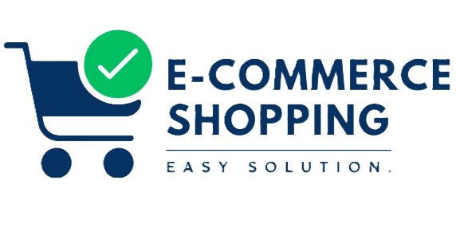
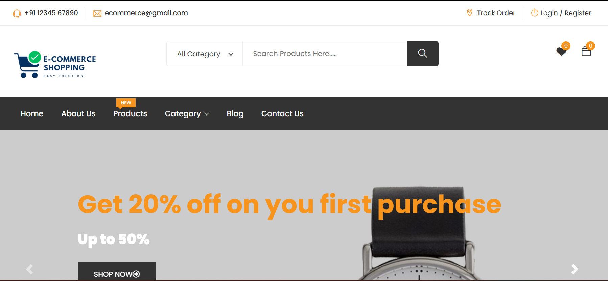
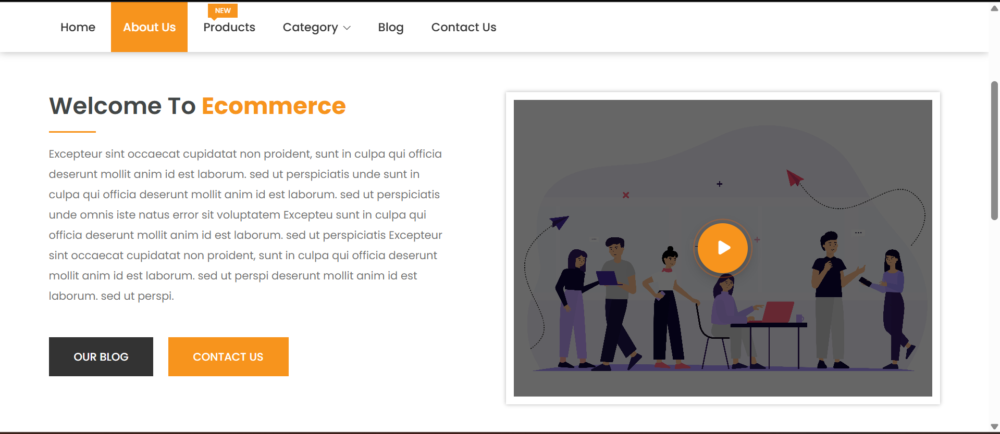
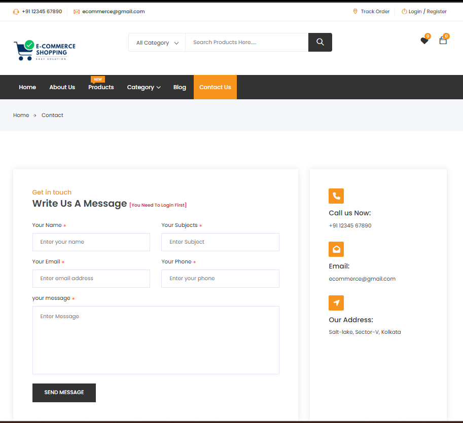
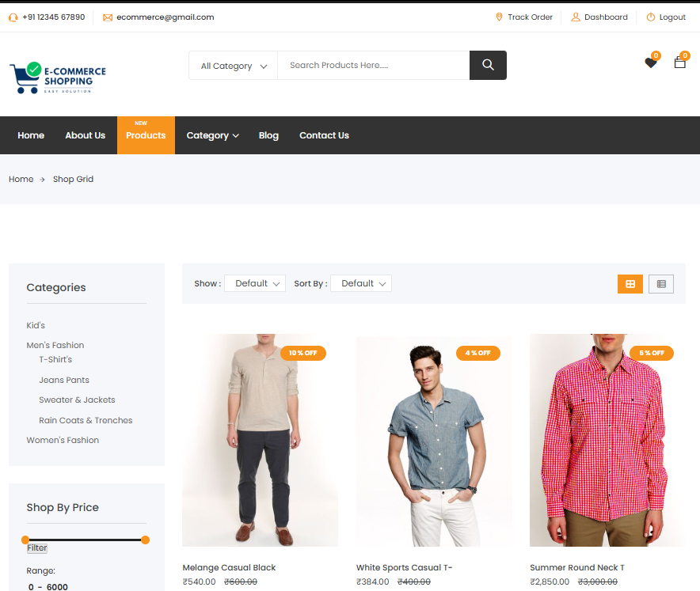
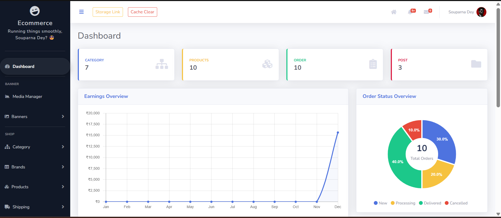
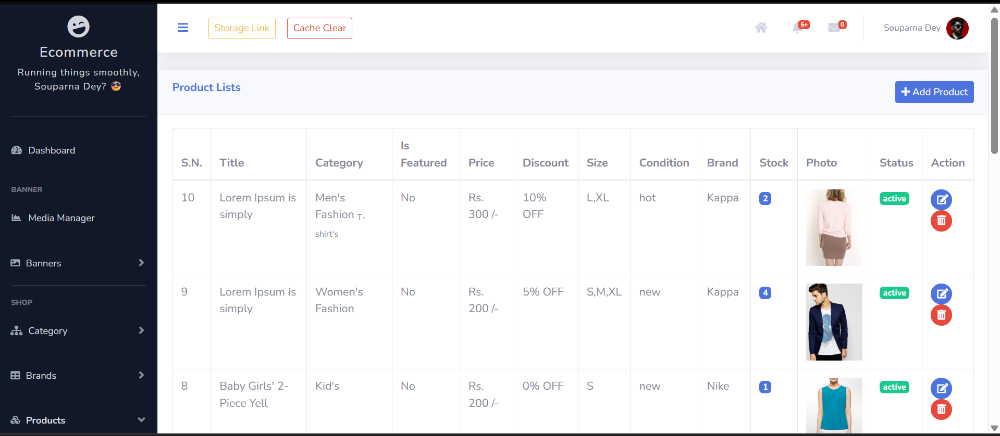
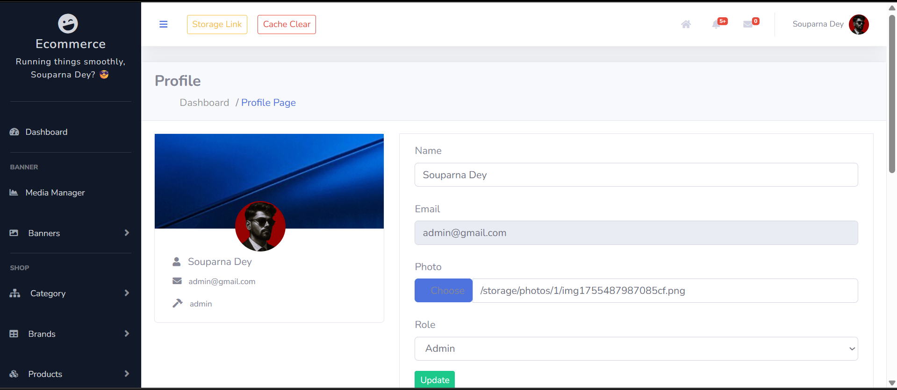

<div align="center">



# 🚀 Complete eCommerce Web Application in Laravel
### A Complete Full-Stack E-Commerce Platform Built with Laravel

[](LICENSE)
[](https://laravel.com)
[](https://livewire.laravel.com)
[](https://www.php.net)
[](https://tailwindcss.com)
[](https://getbootstrap.com)

<p align="center">
  <a href="https://laravel.com" target="_blank">
    
  </a>
</p>

<a href="https://github.com/laravel/framework/actions"></a>
<a href="https://packagist.org/packages/laravel/framework"></a>
<a href="https://packagist.org/packages/laravel/framework"></a>
<a href="https://packagist.org/packages/laravel/framework"></a>

</div>

---

# 📌 About The Project

A production-ready, full-featured **e-commerce solution** built with Laravel (PHP), offering a modern UI & frontend design, full-fledged & secure admin panel with role-based authentication, seamless payment integration and a smooth & user-friendly shopping experience.

> This project follows best practices in Laravel architecture, MVC separation, reusable components, and scalable database design — making it ideal for learning, customization, or real deployment.

---

## 🎯 Objective

This project demonstrates a complete, real-world e-commerce workflow including product management, order processing, payments, authentication, and role-based administration using Laravel.

---

## 👥 Who Is This For?

- Laravel developers looking for a real-world e-commerce reference
- Students learning full-stack Laravel development
- Freelancers building scalable e-commerce solutions
- Recruiters evaluating Laravel project architecture

---

## 🌟 Features List

### 🔹 **Frontend**
- ⚡ **Progressive Web App (PWA) support**
- 🎨 **Clean, modern & fully responsive UI**
- 🛒 **Cart, wishlist & checkout system**
- 📜 **FAQ, help, terms & conditions**
- 📦 **Order tracking & history**
- 🔎 **Product search & category filtering**
- 📈 **SEO-friendly URLs & metadata**
- 💳 **Integrated PayPal payment gateway with UPI & Cash-on-Delivery (COD) options**
- 📢 **Social Authentication (Google/Facebook)**
- 💬 **Multi-level comments, queries & reviews**

### 🔹 **Admin Dashboard**
- 📊 **Advanced analytics & reporting**
- 🔐 **Full-featured & secure admin panel with modern UI**
- 🎛️ **Role & permission management**
- 🛍️ **Product & order management**
- 🔔 **Real-time notifications & messaging**
- 🏷️ **Coupon & discount system**
- 📰 **Blog & CMS management**
- 📸 **Media & banner management**

### 🔹 **User Dashboard**
- 📦 **Order history & tracking**
- 💬 **Reviews & comments**
- 🔧 **Profile customization**

## ⚡ Standout Features

### 🔹 **User Perspective**
- Users can go from **Browsing → Cart → Checkout → Order confirmation** without friction.
- **Category, sub-category, Price, Brand filtering** with active **Product search** support.
- **Wishlist & Cart** support.
- **Reviews & Comments**.
- **Order History & Order Tracking**.
- Separate **User Profile** section with customization options.
- Responsive UI and **Policies, FAQ, Help** section.

### 🔹 **Admin Perspective**
- Admins have a **dedicated backend (Secure Authentication)**, separate from users.
- Admins can manage and control everything without touching code from start to finish:
  -  **Products, categories, brands, users, posts**
  -  **Notifications & messages**
  -  **Homepage banners & CMS pages**
  -  **Coupons & discounts**
  -  **Stock & availability**
  -  **View all orders**
  -  **Track payment & shipping status**
  -  **Update order progress**
  -  **Generate & download professional invoices (PDF) with shipping & customer details**

---

## 🧰 Tech Stack

| Layer | Technology |
|---|---|
| Backend | Laravel 10+, PHP 8.2+, Javascript|
| Frontend | Blade Templates |
| Styling | Bootstrap 5, Tailwind CSS |
| Database | MySQL (via XAMPP) |
| Auth | Laravel Auth |
| Charts Algorithm | Chart.js |
| API | RESTful APIs |
| Sessions | File-based driver |

---

## 📷 Screenshots

### **Homepage**


### **About Us**


### **Contact Us**


### **Products Section**


### **Admin Dashboard**


### **Product Management**


### **User Dashboard**


---

## 🛠️ Installation Guide

### 🔹 **Step 1: Clone the Repository**
```sh
git clone https://github.com/souparnadey/Complete-eCommerce-Web-Application-in-Laravel
cd Complete-eCommerce-Web-Application-in-Laravel
```

### 🔹 **Step 2: Install Dependencies**
```sh
composer install
npm install
```

### 🔹 **Step 3: Environment Setup**
```sh
cp .env.example .env
php artisan key:generate
```
Update `.env` with database credentials:
```env
DB_DATABASE=ecom_app
DB_USERNAME=root
DB_PASSWORD=
```

### 🔹 **Step 4: Database Configuration**
```sh
php artisan migrate --seed
```
**Important Note:**  
If migration fails, you may manually import `database/ecom.sql` directly into your database.

Enable foreign key checks, if required!

### 🔹 **Step 5: Setup Storage**
```sh
php artisan storage:link
```

### 🔹 **Step 6: Run the Application**
```sh
php artisan serve
```
🔗 Open http://127.0.0.1:8000 or `http://localhost:8000`

### **Admin Login Credentials:**
📧 **Email:** `admin@gmail.com`  
🔑 **Password:** `1111`

**⚠️ Note: Default admin credentials are for demo purposes only. Please change them immediately in production.**

---

## 🔐 Security Notes
- Change default admin credentials immediately after setup
- Use environment variables for payment gateway keys
- Do not expose `.env` or sensitive configuration files

---

## 🫱🏻‍🫲🏼 Contributing

Have ideas to improve the system? Feel free to:

-   Submit a **Pull Request (PR)**
-   Create an **Issue** for feature requests or bugs
-   **Fork** the repo, make your improvements or bug fixes, and push the changes to your fork

---

## 📩 Contact Me
💼 Need a **Full Stack Laravel Developer**? Let's work together! ☺️

- 📧 **Email:** deysouparna03@gmail.com   

🔗 **[Hire Me on Linkedin](https://linkedin.com/in/souparna-dey-69a701285/)**

---

## 📜 License
🔹 This project is **[MIT Licensed](LICENSE)** – Feel free to use & modify!

⭐ **If you find this project helpful, don't forget to star it! :)** ⭐

**Thank You ☺️**

---

> Find me on:  [GitHub](https://github.com/souparnadey/) &nbsp;&middot;&nbsp; [LinkedIn](https://linkedin.com/in/souparna-dey-69a701285/) &nbsp;&middot;&nbsp; [Instagram](https://instagram.com/i_am_souparna/) &nbsp;&middot;&nbsp; 

